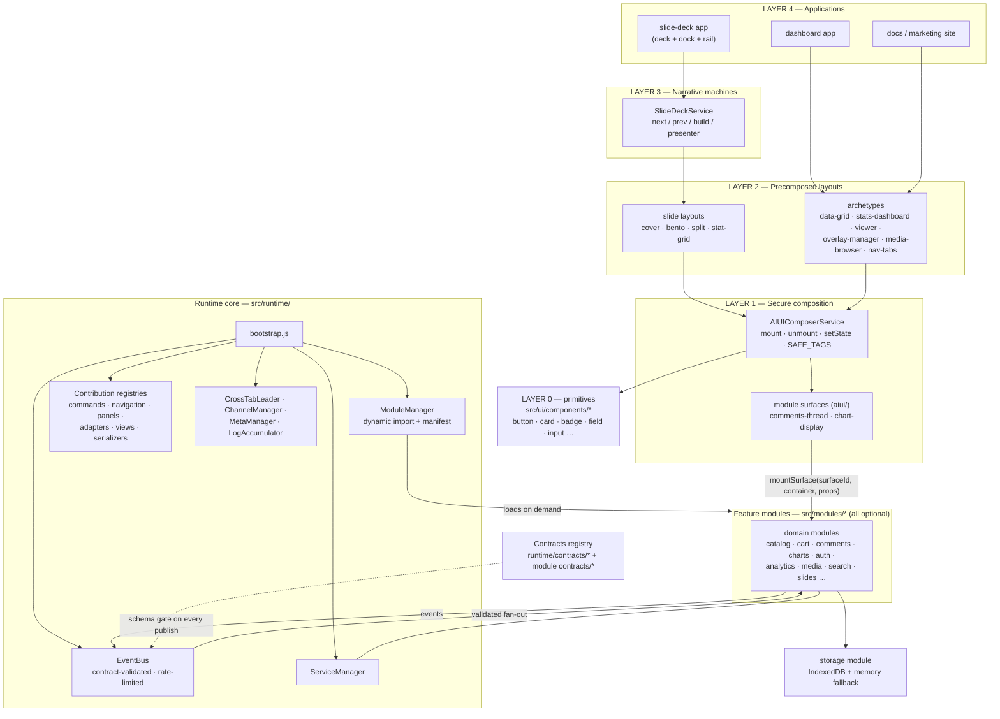

<!-- version: 2.0.0 | tags: architecture, eventbus, contracts, css, design-tokens, components -->

# CSMA Architecture Skill

Core architecture knowledge and component-building rules for the CSMA
(Client-Side Microservices Architecture) system.

## The Three Axes (read this first)

CSMA documentation talks about style, tiers, and behavior types as three
orthogonal axes. Confusing them is the most common onboarding error — they
combine freely, they do not nest.

| Axis | Question it answers | Where it lives | Governed by |
|---|---|---|---|
| **A — Style** | How does it look? | `DESIGN.md` → `token-overrides.json` → `npm run tokens:patch` → `src/generated/tokens.css` | `docs/design/SKILL.md` |
| **B — Composition tier** | How big a chunk am I building? | The layer cake (0–4 below) | this skill + `docs/archetypes/USAGE.md` |
| **C — Behavior type** | Does this one component need JS? | Type I / Type II classification *within* a tier | this skill (§ Component Types) |

Two clarifications that resolve most confusion:

1. **Type I / Type II is not a tier.** It classifies a single component at any
tier: Type I = pure CSS, state via `data-*`; Type II = CSS + JS with an
`init[Name](eventBus) → cleanup` lifecycle. A primitive can be Type I
(`badge`) or Type II (`toast`); so can a module surface.
2. **Modules are not in the visual cake.** `src/modules/*` are state/logic
services over the EventBus (auth, comments, data-table…). They are the brain
the cake talks to, not a layer of it. Archetypes never import them and they
never import archetypes — app code bridges the two via `emit → INTENT_*`.

**"Template" disambiguation** — three different things share that word; do
not conflate them:

| Term | What it is | Shape | Where |
|---|---|---|---|
| **Page layout** | Whole-page template (homepage, category, video detail, auth) — arrangement, landmarks, spacing | Pure render fn → spec tree (stateless) | project code; slide layouts are the existing instance | 
| **Archetype** | Interactive shell embedded inside pages (grid, viewer, settings) — owns interaction lifecycle | Stateful factory `create*(el, emit, opts)` → `update`/`destroy` | `src/modules/archetypes/` |
| **Planning scaffold** | Markdown planning-document boilerplate | `.md` file | `docs/product-planning/templates/` (SITE.md, page.md, …) |

Rule of thumb: a page layout answers "where do things go on this page?"; an
archetype answers "how does this widget behave?". A video-blog detail page =
page layout (player + meta + related grid) embedding the `viewer` archetype
(player) and `media-browser` archetype (related rows). Page layouts are
project-specific; archetypes are cross-project shells. Slide layouts are the
proof the page-layout concept already works — `src/modules/slides/layouts/`
is a set of page templates scoped to one domain.

### UI vocabulary (the full ladder)

The industry uses overlapping words (shadcn "components", Gutenberg
"blocks/patterns"). CSMA's ladder, each rung defined by its **defining
trait** — grouping is incidental, not definitional:

| Term | Defining trait | Form | Where |
|---|---|---|---|
| **Primitive** | One visual atom under the 8-state discipline | CSS (+ optional JS for Type II), `manifest.json` | `src/ui/components/` |
| **Module UI** | UI bound to one domain's state and intents | rendered by a module service (`auth-ui` login form, `comments-thread`) | `src/modules/<module>/ui/` (+ `aiui/` surfaces) |
| **Archetype** | Owns an interaction lifecycle; state fed via `emit`, zero module imports | Stateful factory `create*(el, emit, opts)` → `update`/`destroy` | `src/modules/archetypes/` |
| **Pattern** | **Guidance, not code** — where things go, responsive rules, landmarks | Prose recipes | `docs/patterns/SKILL.md` |
| **Page layout (template)** | The code artifact implementing a pattern | Stateless pure render fn → spec tree | project code (slide layouts = existing instance) |
| **Catalog** | What aiui can mount — nothing more | Generated registry | `src/modules/ai-ui/catalog/componentCatalog.js` |

Three litmus tests resolve the common boundary cases:

1. **Bound to domain state/intents?** → module UI. The login form is NOT an
   archetype despite being "a group of primitives" — it binds to auth flows,
   form-management, captcha, session state.
2. **Cross-project interactive shell, state via `emit`?** → archetype
   (data-grid, viewer).
3. **Stateless arrangement?** → page layout (auth-split page).

**"Catalog" is strict:** the generated `componentCatalog` contains only
aiui-mountable components — primitives with `aiUi.enabled: true` plus module
surfaces (`src/modules/*/aiui/`). Archetypes, patterns, and page layouts are
NOT in the catalog; they are consumed by different mechanisms (factory call,
doc reading, render fn respectively). Do not use "catalog" as a synonym for
"all the UI we ship".

**Industry mapping** (to translate outside vocabulary into CSMA terms):

| Industry term | ≈ CSMA equivalent |
|---|---|
| shadcn "component" | spans two rungs: their `button` = primitive; their `card`/`form` composites lean page-layout |
| shadcn "block" (login-01, sidebar-07) | page layout — stateless pre-composed arrangement |
| Gutenberg "block" | primitive (Type I or II) |
| Gutenberg "pattern" | page layout — note the inversion: Gutenberg pattern = code artifact, CSMA pattern = prose recipe |
| design-system "component library" | the seed catalog (primitives + generation workflow) |

One-liner: **primitives = atoms · module UI = domain-bound UI · archetypes =
stateful widgets · patterns = recipes (prose) · page layouts = cooked pages
(code) · catalog = what aiui can mount (atoms + module surfaces).**

## The Build Chain (how a surface goes from brief to shipped)

```
 1. PLAN       product-planning/SKILL → SITE.md / APP.md / pages/*.md
                 │  what surfaces exist, what flows
 2. STYLE       design/SKILL → DESIGN.md front matter → token-overrides
                 │  → npm run tokens:patch → showcase inspection
                 │  (Axis A — every later step consumes var(--token) only)
 3. STRUCTURE   patterns/SKILL recipes → page layout per surface
                 │  landmarks, grids, responsive rules, containment
 4. VOCABULARY  primitives — seed catalog or create-component siblings
                 │  each classified Type I / Type II; manifests; regen
                 │  catalog via generate-ai-ui-catalog
 5. COMPOSE     agent writes spec trees via ai-ui/specHelpers → mountTree
                 │  novel surfaces: catalog components + raw elements,
                 │  all through the one secure composition pipeline
 6. EXTRACT     repeated shells get extracted:
                 │  · interactive shell 2nd use → archetype (Archetype
                 │    contract, emit boundary)
                 │  · page shape 2nd use → project page layout fn
                 │    (slide-layout pattern generalized, pure render → spec tree)
 7. STATE       modules own data/intents; app code maps emit → INTENT_*
                 │  EventBus contracts validate every publish
 8. NARRATIVE   if the app is a deck → SlideDeckService on top (Layer 3)
 9. VERIFY      npm run verify (design · styles · security-check · vitest)
                 · check:graph (no dead files) · check:state-vocab
                 · certify:module for new modules
```

Skill-to-step map: product-planning→1, design→2, patterns→3, architecture
→4–7, slides→8, rigor/testing→9. Scripts *execute* step 2 and step 4's
catalog regeneration; every other step is agent-built on rails and
gate-verified after.

**Rails vs scripts, explicitly:** agents plan and build; scripts verify.
The rails are contracts (archetype skeleton, spec-node grammar, 8-state
manifests) plus the checks that enforce them. There is intentionally no
`create-archetype` scaffold — see the extraction rule below.

**The extraction rule (step 6):** extract only on the **second** occurrence.
First use: compose inline with `spec()`/`mountTree()` following patterns
recipes. Second use of an interactive shell → extract into
`src/modules/archetypes/<name>/` copying the Archetype contract. Second use
of a page shape → extract a project page-layout function (same pure-render
shape as slide layouts) near the app code that shares it. Before either
point, extraction is speculative code — the repo just deleted a wave of it.
(Freeze rule: no new archetype without a real consumer.)

## Core Philosophy

CSMA separates concerns: **JavaScript manages state via events, CSS handles
rendering**. This achieves fast DOM updates and a minimal bundle size.

CSMA is **modules-first**. Prefer trusted modules under `src/modules/*`,
`Contracts` for validation and security, contribution registries for commands,
navigation, panels, adapters, and views, and lifecycle-safe load/unload
through `ModuleManager`, `ServiceManager`, `syncWindowRuntime()`, and
`destroyRuntimeState()`.

Global primitives under `src/ui/components/` are only for cross-app atomic UI.
Domain UI patterns belong inside their owning module, usually
`src/modules/<module>/ui/`, and can advertise reusable agent-safe patterns with
`manifest.aiUi.components`.

Module boundary:

- CSMA modules own only the client-side half: UI state, EventBus contracts,
  adapters, optimistic behavior, and safe local/cache behavior
- modules never import other modules — the `ai-ui` composition seam is the
  sanctioned exception; cross-module reuse goes through the vendoring rule,
  the EventBus, or ServiceManager (enforced by `npm run security-check`)
- backend/edge companions own authority: secrets, DB writes, payment sessions,
  private search indexes, moderation, RBAC, audit sources, imports, and workflow persistence
- the vertical frontend modules currently include `catalog`, `cart`,
  `cms-content`, `comments`, `reviews`, `payment-adapters`, `permissions-ui`,
  `charts`, `admin-audit-log`, `import-export`, `content-workflow`,
  `edge-search`, `feature-flags`, `content-prefetch`, and `ab-testing`
- do not put backend authority or deployment orchestration into CSMA modules

- **Legacy reference**: `docs/legacy/features.js` documents the SSMA-era
  module loading waves (network → sync → optimistic; captcha/form before
  auth-ui/checkout; consent before analytics/notifications; router before
  client navigation; file-system before file-upload/media). It is quarantined
  history, not live runtime — the live path is `bootstrap.js` + `ModuleManager`.

Routing boundary:

- core runtime owns path normalization, page resolution, and optional History API interception
- the optional `router` module owns SPA/hybrid route orchestration
- static public MPA pages should stay real HTML outputs rather than JS HTML injection

Localization and SEO boundary:

- `i18n` owns locale state, translation loading, and language switching
- `meta-manager` owns `<title>`, meta tags, canonical links, hreflang alternates, and JSON-LD output
- page/app code composes localized SEO payloads and passes them through `PAGE_CHANGED` or `metaManagerModule`

Rigor is layered on top of this baseline. Use standard CSMA first, then add
property tests, service-local transitions, or stronger verification only when
the module risk justifies it. See `docs/rigor/SKILL.md`.

## The 6 Rules

### 1. State Changes = CSS Classes Only

```javascript
// CORRECT
element.className = 'card completed high-priority';
element.dataset.state = 'loading';

// WRONG
element.style.opacity = '1';
element.style.borderColor = 'green';
```

Exception:
Transient inline styles produced by CSS animation/keyframes or GSAP at runtime
are acceptable as animation output. Inline styles are still not allowed as the
durable source of truth for UI state.

### 2. Define All States in CSS

```css
.card[data-state="pending"] { border-inline-start: 4px solid var(--warning); }
.card[data-state="completed"] { border: 4px solid var(--success); }
.card[data-state="loading"] { opacity: 0.7; pointer-events: none; }
```

### 3. JavaScript Publishes Events, CSS Handles Rendering

```javascript
// Service publishes event
class NoteService {
  saveNote(note) {
    const validated = this.validate(note);
    this.eventBus.publish('NOTE_SAVED', validated);
  }
}

// UI subscribes and updates class
eventBus.subscribe('NOTE_SAVED', (note) => {
  document.getElementById(`note-${note.id}`).className = `card ${note.status}`;
});
```

### 4. Security First - Always Validate

```javascript
// CORRECT: textContent + validation
element.textContent = userInput;
const [error, validated] = Schema.validate(userInput);
if (error) throw error;
eventBus.publish('NOTE_SAVED', validated);

// WRONG: parse user-controlled markup or skip validation
parseAndAppendUserMarkup(element, userInput); // XSS vulnerability!
```

### 5. Data Attributes for Complex State

```javascript
// CORRECT
Object.assign(element.dataset, {
  status: 'pending',
  priority: 'high',
  category: 'urgent'
});

// WRONG
element.className = 'card pending high priority urgent category';
```

### 6. Self-Contained Components Subscribe to Own Intents

```javascript
export function initToastSystem(eventBus) {
  const unsubscribe = eventBus.subscribe('INTENT_TOAST_SHOW', (payload) => {
    showToast(payload);
    eventBus.publish('TOAST_SHOWN', { toastId: payload.id, timestamp: Date.now() });
  });

  return () => { unsubscribe(); };
}
```

## Component Types

| Type | Name | Init Pattern | When to Use |
|------|------|--------------|-------------|
| I | Pure CSS | None | Static visuals (Badge, Button, Toggle-Card, Slider) |
| II | Self-Contained | `init[Name]System(eventBus)` | Simple interactions (Toast) |

### Type I -- Pure CSS

Only CSS. Uses `data-*` attributes for variants and states. No JS needed.

```
button/
  manifest.json    # AIUI catalog entry (propsSchema, slots, render, behavior)
  button.css        # Component styles using design tokens
  button.demo.html  # Optional showcase template
```

Reference: `src/ui/components/button/button.css`

Each Type I component has a `manifest.json` with an `aiUi` block that defines:

- `propsSchema` — allowed string props (e.g. `label`, `value`, `state`)
- `slots` — named child containers with `selector` + `allowedChildren`
- `render` — DOM tag, className, attributes, children, `textProp`
- `behavior` — role, events, `intentMap` (e.g. `{"click": "settings:select"}`)
- `style` — `surfaceAware`, `supportsVariant/Size/Tone`

### Type II -- EventBus-Driven

CSS + JS. JS exports `init[Name]System(eventBus)` returning a cleanup function.

```
toast/
  manifest.json
  toast.css
  toast.js          # initToastSystem(eventBus) → cleanup function
```

Reference: `src/ui/components/toast/toast.js`

### AIUI Composer Service

The `src/modules/ai-ui/` module provides `AIUIComposerService` — a secure
DOM composition engine that:

- **Catalog**: primitives in `src/ui/components/*/manifest.json` PLUS module
  surfaces in `src/modules/*/aiui/*.json`. Auto-generated via
  `npm run generate-ai-ui-catalog`. Two scan roots, one merged catalog.
- **Ops**: `mount`, `unmount`, `clear`, `reorder`, `updateProps`, `setState`,
  `setText` — all validated before DOM mutation.
- **SAFE_TAGS**: layout, forms, tables, media, text semantics, AND drawing
  tags (`canvas`, `svg`, `path`, `g`, `line`, `circle`, `rect`, `polyline`,
  `polygon`). Never allows `script`, `iframe`, `style`, `object`, `embed`.
- **Module surfaces**: a catalog entry with `component.moduleId` resolves via
  `serviceManager.get(moduleId).mountSurface(surfaceId, container, props)`. See
  the Layered Rendering Architecture section below.
- **Intent system**: manifest `behavior.intentMap` maps DOM events to CSMA
  intents (e.g. `click → settings:select`). The controller subscribes and
  emits ops — the component itself never touches DOM directly.

To create a new Type I component, see the `csma-component-creation` skill.

### Layered Rendering Architecture

## Where UI Lives — the Three Folders

Agents must pick the correct folder. Getting this wrong creates drift.

### 1. `src/ui/components/<name>/` — Shared Primitives (Layer 0)

For cross-app atomic UI. Every folder has `manifest.json`. The litmus test:
**"Would another module ever reuse this?"** If yes, it belongs here.

Examples: `button`, `card`, `badge`, `field`, `count-up`, `tilt-card`.

This folder is a **seed catalog, not a fixed palette**. The seeds are the
reference implementations that teach the manifest schema (8 states, Type I/II,
contracts) and calibrate the checks — they are also what the generator
produces siblings of. The intended workflow for bespoke UI is:

```
npm run create-component <name>   # scaffolds manifest + CSS + preview here
# edit the generated manifest/props to fit the brief
npm run generate-ai-ui-catalog   # regenerates the aiui catalog (generated artifact)
# compose via AIUIComposerService / aiui ops
```

Agents should generate project-specific components alongside the seeds
rather than bending a seed past its contract (vendoring rule still applies
for module-scoped variants).

### 2. `src/modules/<module>/ui/` — Scoped Domain UI

For components unique to one module. Two valid reasons to put something here:

1. **Module-specific** — no other module would ever use it (e.g. `EditorToolbar`
   in `visual-editor/ui/`, `CommentsPicker` in `comments/ui/`).
2. **Vendored** — the module needs to modify a shared component's behavior.
   Copy the component here, modify it, document the delta in the module's
   README. Never alter `src/ui/components/` to serve one module.

### 3. `src/modules/<module>/aiui/` — Embeddable Module Surfaces

ONLY used when a module wants to be mounted INSIDE other surfaces via the
`mountSurface` contract. This is the Layer 1 ↔ module boundary — the aiui
composer resolves `component: 'comments-thread'` by reading the manifest,
calling `serviceManager.get(moduleId)`, then `mountSurface(surfaceId, container, props)`.

**Requirements**:
- `aiui/manifest.json` with `component.moduleId` and `aiUi.render.kind: "module"`
- `mountSurface(surfaceId, container, props) → cleanupFn` on the module's service

**Currently registered**: `comments-thread`, `chart-display`.

**Anti-pattern**: adding `aiui/` to an app-shell module (slides, dashboards).
App shells CONSUME surfaces; they do not offer them. If nobody mounts your
module inside a slide, you don't need `aiui/`.

### Quick Decision Table

| Question | Answer | Folder |
|----------|--------|--------|
| Is it a generic UI widget (button, card, counter)? | → | `src/ui/components/` |
| Is it specific to one module AND no other module would use it? | → | `src/modules/<module>/ui/` |
| Does a module need to modify an existing shared component? | → | Vendor into `src/modules/<module>/ui/` |
| Should this module be embeddable inside slides/dashboards? | → | `src/modules/<module>/aiui/` |
| Is this module the top-level app shell (slides, dashboards)? | → | No `aiui/` needed |

### Vendoring Rule

```
If module X needs different behavior from component Y:
  1. Copy Y from src/ui/components/<y>/ into src/modules/<X>/ui/<y>/
  2. Modify it
  3. Document the delta in src/modules/<X>/README.md
  4. Never change src/ui/components/<y>/ for X's needs alone
```

### Layered Rendering Architecture

CSMA renders through a strict layer cake. Each layer composes the layer
immediately below — no skipping:

```
LAYER 4  APPLICATIONS         slide-deck app · dashboard app · docs site
LAYER 3  NARRATIVE MACHINES   SlideDeckService (next / prev / build / presenter)
LAYER 2  PRECOMPOSED LAYOUTS  archetypes (data-grid, stats-dashboard, …) +
                             slide layouts (cover, bento, stat-grid, …)
LAYER 1  SECURE COMPOSITION   aiui (mount / unmount / setState on catalog)
LAYER 0  PRIMITIVES           CSMA components (button, card, badge, field, …)
```

**Runtime and dataflow view** — the same layers, plus the runtime core,
module system, and security boundary (renders on GitHub):



**What belongs where**

| Concern | Layer | Owner |
|---------|-------|-------|
| Button, card, badge, input rendering | 0 | `src/ui/components/` |
| `mount` / `unmount` / `setState` ops, SAFE_TAGS, catalog | 1 | `src/modules/ai-ui/` |
| A precomposed grid of stat cards | 2 | archetypes (compose via aiui) |
| A slide layout (`cover`, `bento`, `split`) | 2 | slide layouts (compose via aiui) |
| A whole-page web template (homepage, category, detail) | 2 | project page layouts — pure render fns emitting spec trees (slide-layout pattern generalized) |
| `next()` / `prev()` / build steps / cross-tab sync | 3 | `SlideDeckService` (slides module) |
| A whole deck with dock + rail + grid | 4 | the slides app composition |

The layer-3 state machine (advance, build, presenter mode) is **not** a
composition problem. aiui has no concept of "advance to next slide". Keeping
`SlideDeckService` is correct; layouts compose through aiui underneath it.

**`mountSurface` contract** (Layer 1 ↔ module services)

Any module that wants to be embeddable via aiui — so it can appear inside a
slide, a dashboard tile, a docs page sidebar, anywhere — MUST expose:

```javascript
class SomeService {
  /**
   * @param {string} surfaceId   matches a manifest in src/modules/<module>/aiui/
   * @param {HTMLElement} container
   * @param {object} props       declared in the surface manifest's aiUi.props
   * @returns {() => void} cleanupFn  called when aiui unmounts the surface
   */
  mountSurface(surfaceId, container, props) { /* … */ }
}
```

The composer resolves `spec: { component: '<surfaceId>' }` by reading the
catalog entry's `component.moduleId`, calling `serviceManager.get(moduleId)`,
then `mountSurface(surfaceId, container, props)`. The returned cleanup fn is
invoked on unmount. If the module isn't loaded, the composer throws a clear
error the agent can handle.

**Currently registered module surfaces**: `comments-thread`, `chart-display`.

**Why unify on aiui for Layer 1**

1. Single mental model — agents learn aiui once, compose anything.
2. Mix-and-match content — a slide embeds comments and charts.
3. Streaming-ready — progressive mount/unmount for live-built UI.
4. One security boundary — every composition passes the same SAFE filter.
5. One extension point — new module registers a manifest + `mountSurface`.

Migration is **incremental**, not big-bang. The current status of the
unification initiative lives in `docs/roadmap.md` (search: *aiui Unification*).

### Layer 2 archetype pattern

**Decision: factory-wrapping (Option a).** Layer-2 archetypes are stateful
factories (lifecycle, event listeners, internal state). Unlike Phase 2.0 slide
layouts — which are pure render functions that were mechanically translated
into spec trees — archetypes own an entire interaction lifecycle and cannot be
reduced to a static catalog entry. CSMA therefore wraps each archetype's
internals in `getComposer().mountTree(spec, target)` while keeping its existing
`create*(container, emit, options)` public signature. This was chosen over
catalog-archetype components (Option b) because archetypes take imperative
arguments the catalog's JSON-serializable-props contract cannot express —
`overlay-manager.openModal(domNode, { onClose })`, `stats-dashboard({
renderChart: fn → Node })` — which would force exceptions for at least 2/8
archetypes and give Phase 3.1 two competing patterns. Factory-wrapping needs no
new composer render path, no catalog-generator scan root, and no archetype
registry, and it mirrors how Phase 2.0 layouts already compose: emit spec
trees, mount through the single aiui pipeline.

**Archetype contract (the pattern Phase 3.1 agents copy)**

```javascript
// src/modules/archetypes/<name>/<name>.js
import { spec, getComposer } from '../../ai-ui/specHelpers.js';

export function createArchetype(container, emit, options = {}) {
    const composer = getComposer();           // process-level shared composer
    // 1. Build the initial DOM as a spec tree, mount through aiui.
    const { root, cleanup } = composer.mountTree(buildSpec(options), container);
    // 2. Query the mounted DOM and wire events on real elements.
    const button = root.querySelector('.archetype__action');
    button.addEventListener('click', () => { /* … */ });
    // 3. Return the lifecycle handle.
    return {
        update(next) { /* re-mount the dynamic subtree via mountTree */ },
        destroy() { cleanup(); },
    };
}
```

- **Spec helpers** live in `src/modules/ai-ui/specHelpers.js` — the canonical
  home for the composition grammar (`spec`, `textNode`, `component`,
  `toAttrs`, `getComposer`). Slides keep their own copy until Phase 3.2.
- **Interactions**: events are wired with standard `addEventListener` on the
  elements `mountTree` returns. Archetypes publish intents via the `emit`
  callback (e.g. `emit('navtabs:select', { id, tab })`); callers map those to
  EventBus contracts. Archetypes never call `eventBus` directly.
- **State updates**: the dynamic subtree is re-mounted (clear + `mountTree` +
  re-wire), exactly as the pre-conversion code re-rendered. This keeps DOM
  byte-identical and avoids introducing a diff engine. Targeted `setState`
  (data-attribute flips) is fine for CSS-driven state.
- **SVG**: icon/vector DOM composes through `mountTree` like any other node.
  `mountTree` creates `svg`/`path`/`line`/`polyline`/… in the SVG namespace
  (required for rendering) and accepts their inert presentation attributes
  (`viewBox`, `stroke`, `points`, …).
- **Forbidden**: raw `document.createElement` / `createElementNS` in archetype
  internals. All element construction MUST go through `mountTree`. Post-mount
  mutation of already-mounted elements (appending caller-supplied content,
  setting runtime-computed inline styles like popover position, wiring events)
  is permitted — it operates on the composer's output, not around it.

## EventBus Patterns

### Subscribe (with cleanup)

```javascript
const unsubscribe = eventBus.subscribe('EVENT_NAME', (payload) => {
  // Handle event
});

// Cleanup on hot reload
return () => unsubscribe();
```

### Publish

```javascript
eventBus.publish('INTENT_ACTION', {
  id: 'element-id',
  value: someValue,
  timestamp: Date.now()
});
```

### Event Naming Convention

- `INTENT_*` -- User actions or component intents (e.g., `INTENT_MODAL_OPEN`)
- `*_COMPLETED`, `*_UPDATED` -- State changes (e.g., `MODAL_OPENED`)
- `SECURITY_*` -- Security events (e.g., `SECURITY_VIOLATION`)

## Contracts

Contracts validate all EventBus payloads.

`src/runtime/Contracts.js` exports **core contracts only** (shared runtime,
component, module-lifecycle, and a few root services). Feature modules own
their contracts under `src/modules/<id>/contracts/*` and export them as
`export const contracts = …` from the module index. `ModuleManager.loadModule`
registers those contracts before contributions are installed, normalizes
intent rate limits, and unregisters them on unload.

```javascript
// Core bootstrap (default-deny base map)
eventBus.contracts = Contracts;

// Module contracts arrive when loadModule runs
// ModuleManager.registerContracts(module.contracts)

// Example module-owned intent
export const FormManagementContracts = {
  INTENT_FORM_SUBMIT: {
    version: 1,
    type: 'intent',
    owner: 'form-management',
    schema: object({ formId: string(), timestamp: number() }),
    security: {
      rateLimits: { requests: 10, windowMs: 60000, scope: 'session' }
    }
  }
};
```

Registries do **not** replace contracts. Contracts validate data and runtime
messages; registries track installed contributions and ownership by module id;
modules and services implement behavior.

Contracts are the production boundary. They are not a substitute for higher
development-time rigor, and they do not imply every service needs a transition
map. Use `docs/rigor/SKILL.md` to decide when to add more.

Tests that construct a runtime without `loadModule` must register the module's
`contracts` export themselves or events will default-deny.

Current runtime registries: `commandRegistry`, `navigationRegistry`,
`panelRegistry`, `adapterRegistry`, `viewRegistry`.

### Validation Destructuring

CSMA uses a fork of Superstruct. Always destructure the tuple:

```javascript
// CORRECT
const [error, validated] = Schema.validate(payload);
if (error) throw error;

// WRONG -- returns array, not object
const validated = Schema.validate(payload);
```

## Security Layers

1. **CSP Headers** -- Restrict script sources
2. **Contract Validation** -- Validate all event payloads
3. **Input Sanitization** -- Use textContent, not innerHTML
4. **Rate Limiting** -- Built into EventBus
5. **Honeypot Fields** -- Bot detection
6. **Schema Spoofing Protection** -- Prototype pollution prevention

## Design Token Pipeline

```
token-overrides.json  ->  patch-tokens.js  ->  design-tokens.json  ->  generate-tokens.js  ->  generated/tokens.css
```

For app-specific token customization, edit `src/style/token-overrides.json` and
run `npm run tokens:patch`. Never edit `tokens.css` directly.

DTCG format basics:
- `$type` -- token type (color, dimension, fontFamily, etc.)
- `$value` -- token value
- `$description` -- optional description

### Token Reference

**Colors**: `--background`, `--surface`, `--foreground`, `--border`,
`--primary`, `--secondary`, `--accent`, `--destructive`, `--success`,
`--warning`, `--info` (each with `-foreground` and/or `-muted` variants).

**Spacing**: `--space-2xs` (2px) through `--space-5xl` (96px).

**Radius**: `--radius-sm` through `--radius-full` (999px).

**Typography**: `--font-family-base`, `--font-family-mono`;
`--font-size-xs` through `--font-size-3xl`; `--font-weight-regular` through
`--font-weight-bold`; `--line-height-tight` through `--line-height-loose`.

**Motion**: `--transition-fast` (120ms), `--transition-normal` (200ms),
`--transition-slow` (320ms).

**Shadows**: `--shadow-xs` through `--shadow-xl`.

**Breakpoints**: `--breakpoint-sm` (480px) through `--breakpoint-xl` (1280px).

**Z-Index**: `--z-base` (1) through `--z-tooltip` (600).

## CSS Conventions

- Single base class + `data-*` attributes (never BEM modifier classes)
- `var(--token)` for every visual value (never raw pixels/colors)
- Focus ring: `box-shadow: 0 0 0 2px var(--background), 0 0 0 4px var(--ring)`
- `prefers-reduced-motion: reduce` disables transitions/animations
- Theme switch: `document.documentElement.dataset.theme = 'light' | 'dark'`

## Component Structure

Each component lives in its own folder under `src/ui/components/`:

```
your-component/
  your-component.css   # required -- all visual states
  your-component.js    # optional -- only for Type II components
```

## Adding a Component

1. Create `src/ui/components/<name>/<name>.css` with all visual states
2. (Optional) Create `<name>.js` for Type II -- export
   `init[Name]System(eventBus)`
3. Add `@import './<name>/<name>.css';` to `src/ui/components/index.css`
4. (Type II) Import and call init in your bootstrap file

## What To Watch For

- Do not hardcode color fallbacks when a semantic token exists.
- Do not use `innerHTML` for user data -- always use `textContent`.
- Do not use inline styles for state changes -- use CSS classes or
  `data-*` attributes.
- All visual values must reference `var(--token-name)`.

## 8-State Discipline

Every interactive CSMA component must define CSS for all 8 visual states.
This ensures predictable behavior across themes, registers, and contexts.

### Required states

| State | Attribute / Selector | Purpose |
|-------|---------------------|---------|
| Default | *(base selector)* | Resting, no user interaction |
| Hover | `.is-hover` or `:hover` | Mouse pointer over element |
| Active | `.is-active` or `:active` | Element is being pressed |
| Focus | `.is-focus` or `:focus-visible` | Keyboard focus |
| Disabled | `[disabled]` or `[aria-disabled="true"]` | Non-interactive |
| Loading | `[data-state="loading"]` | Async operation in progress |
| Error | `[data-state="error"]` or `[aria-invalid="true"]` | Validation or operation error |
| Selected | `[aria-pressed="true"]` or `[data-state="selected"]` | Toggleable element selected |

### Preview classes for static inspection

In `preview.html` files (generated by `create-component`), CSS simulation
classes `.is-hover`, `.is-focus`, and `.is-active` mirror their
pseudo-class equivalents for static rendering:

```css
/* Component CSS should mirror hover styles for preview */
.my-button:hover,
.my-button.is-hover {
  background: var(--primary-foreground);
  color: var(--primary);
}

.my-button:active,
.my-button.is-active {
  transform: scale(0.98);
}

.my-button:focus-visible,
.my-button.is-focus {
  box-shadow: 0 0 0 2px var(--background), 0 0 0 4px var(--ring);
}
```

### Generating preview files

When you create a component with `create-component`, it generates a
`{name}.preview.html` showing all 8 states in a grid. Use this page to
verify state styles are complete and visually consistent before shipping.

### Error vs Success states

`[data-state="error"]` is for error outcomes. For success outcomes, use
`[data-state="success"]`. Both are optional but recommended for components
that display operation results (cards, badges, fields).

```css
.badge[data-state="error"] { background: var(--destructive-muted); color: var(--destructive); }
.badge[data-state="success"] { background: var(--success-muted); color: var(--success); }
```


## Agent Context (state-to-text bridge)

CSMA modules expose their state to AI agents through the **agent-context**
service (`src/modules/agent-context/`). It is the canonical bridge between
runtime state and LLM-readable text. Direct IDB queries or per-module
`toMarkdown()` helpers should not be reinvented — register a serializer
instead.

### Contribution shape

Any module that wants its state readable by an agent declares serializers
in its manifest:

```js
contributes: {
  contextSerializers: [
    { store: 'maps', format: 'markdown', fn: 'toMarkdown', default: true },
    { store: 'maps', format: 'ascii',    fn: 'toAscii' },
    { store: 'maps', format: 'json',     fn: 'toMinimalJson' }
  ]
}
```

- `store` is the IDB store or logical name the serializer targets.
- `format` is `markdown` (default for LLM token economy), `json`, `ascii`,
  or a custom name prefixed with `x-`.
- `fn` is a function (inline) or a string export name resolved against
  the module's service or namespace at call time.

The serializer signature is `(data, options) => string | { text, cursor? }`.
The `data` argument is supplied by the caller (or fetched from `storage`
when available); `options` carries `{ store, id, filter, depth, cursor,
format }`.

### Dispatch and fallbacks

`AgentContextService.get({ store, format, data?, filter?, depth?, cursor? })`
returns `{ text, format, bytes, truncated?, cursor? }`.

When no serializer is registered for `{ store, format }`, the service
falls back to a generic formatter (`MarkdownFormatter`, `JsonFormatter`,
or `AsciiFormatter`) that produces best-effort output over arbitrary
record shapes. Built-in formats are always available even without any
module registered.

Output is truncated at 50KB by default; the response carries
`truncated: true` plus a `cursor` for pagination.

### Subscriptions

`subscribe({ store, format, filter }, cb)` re-serializes and delivers on
each matching `HISTORY_OP_RECORDED` event. Requires the `history` module
to be loaded; otherwise throws `[AgentContext] subscription requires
history module`.

### What agent-context does NOT do

- No MCP server transport in v1 (decision 1a). The `get()` / `subscribe()`
  surface is shaped so a future `mcp-bridge` module can wrap it without
  API changes.
- No streaming. v1 returns complete strings with truncation.
- No authn/authz. The in-browser agent is assumed same-origin and
  trusted. Cross-origin or extension-based agents need the MCP bridge
  with its own auth layer.
- No caching of serialized output. Recompute per `get()`; add an LRU if
  profiling shows hot spots.
