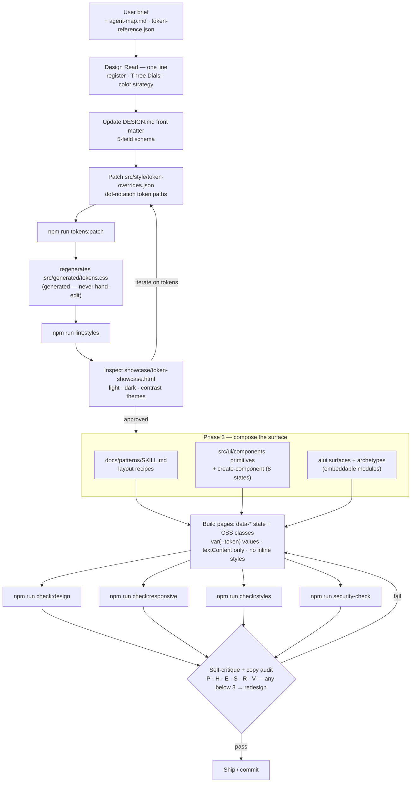

<!-- version: 3.0.0 | tags: design, DESIGN.md, tokens, workflow, register, dials, anti-patterns -->

# CSMA Design Skill

## Purpose

This skill guides design and implementation of CSMA-based sites and apps. It
covers **what to build** (design decisions) and **how to implement it** (token
patches, component composition, quality checks).

The output is a filled `DESIGN.md` at the project root plus concrete token
patches in `src/style/token-overrides.json`.

`DESIGN.md` is the app brief and composition guide. The CSMA base visual
seed/reference for runtime tokens is `src/style/design-tokens.json`. App and
brand changes should be written to `src/style/token-overrides.json`, then merged
into the base file and regenerated into `src/generated/tokens.css` with
`npm run tokens:patch`.

Before reading raw source files under `src/style/` or `src/ui/components/`,
read `docs/design/agent-map.md`. For normal design work, use the map, the
generated token reference, and the showcase before escalating to raw source
inspection.

---

## Workflow Overview

```
Phase 0 — Pre-flight
  Read DESIGN.md, token-overrides.json, agent-map.md
  Read the brief
  Declare one-line Design Read

Phase 1 — Configure
  Set register (brand | product)
  Set Three Dials (variance / motion / density)
  Set color strategy (restrained | committed | full_palette | drenched)
  Update DESIGN.md front matter

Phase 2 — Patch tokens
  Write token-overrides.json (register + dials → token paths)
  npm run tokens:patch
  npm run lint:styles
  Inspect showcase/token-showcase.html

Phase 3 — Compose
  Compose page from CSMA primitives (Type I / Type II)
  Use create-component for new components (8 states)
  Reference CSS via var(--color-*), var(--space-*), var(--font-*)

Phase 4 — Verify
  npm run check:design
  npm run check:responsive
  Pre-emit self-critique (P5/H4/E5/S4/R5/V5 — any <3 → redesign)
  Copy self-audit — re-read every visible string
```

### Workflow diagram

The same flow with its iteration loops and quality gates (renders on GitHub):



---

## Phase 0 — Pre-flight

### 0.1 Read CSMA context

Before making any design decisions, read these files in order:

1. `DESIGN.md` — existing design brief and token intent
2. `src/style/token-overrides.json` — current token patches
3. `tooling/generated/token-reference.json` — machine-readable token reference
4. `docs/design/agent-map.md` — agent workflow reference

### 0.2 Read the brief

Infer these from the user's request. Only ask if genuinely ambiguous (one
question max):

| Signal | If yes → |
|--------|----------|
| "dashboard, settings, admin, tool, app" | `register: product` |
| "landing page, portfolio, brand site, marketing" | `register: brand` |
| User names a brand color / font → | Preserve it, don't override |
| User attached a screenshot / URL → | Extract DNA (structure, not pixels) |

### 0.3 Declare the Design Read

One sentence before any code:

> *"Reading this as: a [brand|product] surface for [audience], with [vibe]
> language, [color_strategy] palette, variance [N], motion [N], density [N]."*

Example reads:
- *"Reading this as: a **product** UI for B2B ops teams, restrained palette,
  variance 5, motion 3, density 6."*
- *"Reading this as: a **brand** landing page for a design-conscious consumer
  brand, committed palette, variance 7, motion 5, density 3."*

This one-liner is the contract for everything downstream. If the user corrects
it later, re-run from Phase 1 with the corrected values.

---

## Phase 1 — Configure

### 1.1 Register system (Brand vs Product)

This is the **most consequential decision**. It changes typography, color,
motion, layout, and component defaults across the entire output.

| Dimension | Brand | Product |
|-----------|-------|---------|
| **Typography** | Display + body pairing, fluid `clamp()` scale | One sans family, fixed rem scale |
| **Color** | Committed / Full palette / Drenched — color IS the voice | Restrained — accent for actions + state only |
| **Motion** | One well-rehearsed entrance, scroll-reveal, choreography | 150-250ms transitions, state feedback only, no page-load sequences |
| **Layout** | Asymmetric grids, generous whitespace, imagery-led | Standard navigation (top bar + sidebar, tabs), denser data layouts |
| **Imagery** | Required for image-led briefs | Screen-driven — components IS the imagery |
| **Cards** | Use deliberately — not the default grouping mechanism | Use for data displays, lists, dashboards |
| **Font attitude** | Distinctive, voice-driven, avoid reflex-reject list | Familiar sans, system fonts OK, one family often right |

Register-specific guidance:
- **Brand** — see `docs/design/references/register-brand.md`
- **Product** — see `docs/design/references/register-product.md`

### 1.2 Three Dials

Set these after the register is chosen. Default baseline for most briefs:
**variance 6, motion 4, density 4.**

| Dial | Range | Low (1-3) | Mid (4-7) | High (8-10) |
|------|-------|-----------|-----------|-------------|
| **Variance** | 1-10 | Symmetric, centered, equal columns | Asymmetric splits, offset grids, varied aspect ratios | Masonry, fractional units (`2fr 1fr 1fr`), intentional empty zones |
| **Motion** | 1-10 | CSS transitions only (hover/active) | Entry animations on scroll, `--motion-duration-fast/normal` | Scroll-driven, sticky stacks, horizontal pan, `--motion-duration-slow` |
| **Density** | 1-10 | Art gallery: `--space-4xl` gaps, generous padding | Balanced: `--space-2xl/3xl` gaps | Cockpit: `--space-lg/xl` gaps, compact |

Dial inference from brief signals:

| Signal | Variance | Motion | Density |
|--------|----------|--------|---------|
| "minimalist / clean / calm / editorial / Linear-style" | 5-6 | 3-4 | 2-3 |
| "premium consumer / Apple-y / luxury / brand" | 7-8 | 5-7 | 3-4 |
| "playful / wild / Dribbble / Awwwards / experimental" | 9-10 | 8-10 | 3-4 |
| "trust-first / public-sector / regulated / accessibility-critical" | 3-4 | 2-3 | 4-5 |
| Product register (default) | 5-6 | 3-4 | 5-6 |

### 1.3 Color strategy

Pick one before picking colors:

| Strategy | What it means | Best for |
|----------|---------------|----------|
| **Restrained** | Tinted neutrals + one accent ≤10% of surface | Product UI default |
| **Committed** | One saturated color carries 30-60% of surface | Brand identity pages |
| **Full palette** | 3-4 named roles, each used deliberately | Brand campaigns, data viz |
| **Drenched** | The surface IS the color | Brand heroes, campaign pages |

### 1.4 DESIGN.md front matter

Update `DESIGN.md` with the chosen values:

```yaml
register: brand | product
color_strategy: restrained | committed | full_palette | drenched
variance: 6
motion: 4
density: 4
```

### 1.5 Interview the user (if needed)

The repo includes `DESIGN.md` as a **template** with placeholder sections and
decision tables. Fill it through conversation with the user. Do not write the
entire file at once. Iterate section by section. One section at a time, one
clarifying question max when genuinely ambiguous.

#### Section: Overview

**Questions to ask:**
- What kind of app is this? (SaaS dashboard, e-commerce, social, tool)
- Who is the primary user?
- How should it feel? (Playful, professional, premium, minimal, dense)
- Any brand colors or fonts already decided?
- Any reference apps or designs the user likes?

#### Section: Visual Distinctiveness

Ask these after the overview and before writing CSS:
- What is the one primary visual moment on a typical screen?
- What are the three hierarchy layers: primary, secondary, tertiary?
- Is the app compact, balanced, or spacious?
- What visual motif should repeat across screens, if any?
- Which visual moves should the app never use?

#### Section: Visual Refinement

Ask these once the core direction is clear:
- Which visual cliches would make this product feel generic or untrustworthy?
- Should the UI feel more editorial, product-like, operational, or tool-like?
- Where should visual emphasis come from: type, layout, color, motion, or imagery?
- Which surfaces should stay plain even if the rest of the app is expressive?

#### Section: Components

Name components specific to the user's app, not generic primitives. Start with
existing primitives before adding new UI: badge, button, card, field, input,
theme-toggle, and toast. Domain-specific UI belongs under
`src/modules/<module>/ui/`.

#### Section: Layout Patterns

Define recurring page structures with spatial recipes.

---

## Phase 2 — Patch tokens

### 2.1 Register → token defaults

```jsonc
// If register is "product":
{
  "primitives.typography.fontFamily.base.$value": "Geist",
  // One family, no display pairing. Fixed rem scale.
  "primitives.typography.fontSize.base.$value": "0.875rem",
  // Tighter spacing for data density
  "primitives.spacing.md.$value": "0.75rem",
  // Accent for actions + state only
  "themes.light.colors.accent.$value": "oklch(55% 0.15 260)",
}

// If register is "brand":
{
  "primitives.typography.fontFamily.base.$value": "Satoshi, sans-serif",
  "primitives.typography.fontFamily.display.$value": "Sentient, serif",
  // Fluid clamp scale for headings
  "primitives.typography.fontSize.xl.$value": "clamp(1.5rem, 3vw, 2rem)",
  // Generous spacing
  "primitives.spacing.md.$value": "1rem",
  // Slower, more expressive motion
  "primitives.motion.duration.normal.$value": "400ms",
}
```

### 2.2 Dials → token values

| Dial | Low (1-3) | Mid (4-7) | High (8-10) |
|------|-----------|-----------|-------------|
| **Density → spacing** | `--space-4xl` gaps, generous padding | `--space-2xl/3xl` gaps | `--space-lg/xl` gaps, compact |
| **Motion → duration** | `fast: 100ms`, `normal: 200ms` | `fast: 150ms`, `normal: 300ms` | `fast: 200ms`, `normal: 500ms` |
| **Variance → layout** | Equal grid, centered | Asymmetric splits (`2fr 1fr`) | Masonry, fractional units |

Variance applies in composed CSS/HTML (not in tokens) using grid column ratios,
alignment choices, and whitespace distribution.

### 2.3 Color strategy → token palette

| Strategy | Token pattern |
|----------|---------------|
| **Restrained** | High-chroma neutrals (zinc/slate), 1 accent ≤10% saturation |
| **Committed** | One saturated carrier color on 30-60% of surface |
| **Full palette** | 3-4 distinct roles: primary accent, secondary, success, warning |
| **Drenched** | Background IS the brand color; foreground reversed |

### 2.4 After writing overrides

```bash
npm run tokens:patch
npm run lint:styles
```

Open `showcase/token-showcase.html` and inspect in light, dark, and contrast
themes before composing pages.

### 2.5 How to edit the token file

`src/style/design-tokens.json` is intentionally broad. Do not edit it directly
for app-specific work. Patch only through `src/style/token-overrides.json`.

| Design decision | Edit this branch |
|:----------------|:-----------------|
| Brand palette, backgrounds, text, status colors | `themes.light`, `themes.dark`, `themes.contrast` |
| Font family, size scale, weights, line heights | `primitives.typography` |
| Compact, balanced, or spacious density | `primitives.spacing`; component padding only when needed |
| Round, sharp, or mixed shape language | `primitives.radius`; `components.button`, `components.card`, `components.input` |
| Flat, bordered, or elevated surfaces | `primitives.shadow`; `components.card`; `components.dialog` |
| Button height, input height, card padding | `components.button`, `components.input`, `components.card` |
| Page width, sidebar width, grid minimums | `primitives.layout` |
| Breakpoint changes | `primitives.breakpoint` |
| Motion timing or easing | `primitives.motion`; `semantic.transition` |

Patch rules:
- Inspect `tooling/generated/token-reference.json` and `docs/design/agent-map.md` before reading raw token source.
- Preserve DTCG shape: `$value`, `$type`, `$description`, and `$extensions`.
- Keep semantic theme names stable unless the user explicitly asks for new themes.
- Keep component tokens as references to primitives when possible.
- Use full dot-notation paths in `src/style/token-overrides.json`.
- Do not edit `src/style/design-tokens.json` or `src/generated/tokens.css` directly.
- After token edits, run `npm run tokens:patch` and `npm run lint:styles`.
- Then inspect `showcase/token-showcase.html` across themes.

Raw-source guardrail:
- Do not read `src/style/design-tokens.json`, `src/style/foundation/*.css`, or `src/ui/components/**/*.css` by default.
- Escalate only when extending a primitive/component or debugging a mismatch.

---

## Phase 3 — Compose

### 3.1 Component discipline

| Type | When | Implementation |
|------|------|---------------|
| **Type I** | Static visual variants, form field styling | CSS only. `data-*` attributes control state. No JavaScript. |
| **Type II** | User action changes app state, async operations | EventBus + Contracts. `init[Component]System(eventBus)` returning cleanup. |

### 3.2 Eight states for every interactive component

Every interactive element must ship styling for all 8 states:

1. **Default** — resting appearance
2. **Hover** — `:hover`, also `.is-hover` for demo wrappers
3. **Focus** — `:focus-visible` with ≥3:1 visible ring
4. **Active** — `:active`, tactile feedback (`scale(0.98)` or `translateY(1px)`)
5. **Disabled** — `[disabled]`, reduced opacity + no pointer events
6. **Loading** — `[data-state="loading"]`, spinner or pulse
7. **Error** — `[data-state="error"]`, red border, error message
8. **Success** — `[data-state="success"]`, green check or brief confirmation

```css
.btn:hover, .btn.is-hover { background: var(--color-surface-muted); }
.btn:focus-visible, .btn.is-focus { outline: 2px solid var(--color-focus); }
.btn:active, .btn.is-active { transform: scale(0.98); }
.btn[disabled] { opacity: 0.5; pointer-events: none; }
.btn[data-state="loading"] { /* pulse animation */ }
.btn[data-state="error"] { border-color: var(--color-destructive); }
.btn[data-state="success"] { border-color: var(--color-success); }
```

### 3.3 State attribute naming

All CSMA components use consistent `data-*` attributes for state:

| Attribute | Purpose | Values |
|-----------|---------|--------|
| `data-state` | Component lifecycle state | `loading`, `ready`, `error`, `success`, `empty`, `closed` |
| `data-variant` | Visual variant | `primary`, `secondary`, `ghost`, `outline`, `destructive`, etc. |
| `data-tone` | Tone/emphasis | `brand`, `neutral`, `muted`, `subtle` |
| `data-size` | Size modifier | `sm`, `md`, `lg` |
| `data-shape` | Shape modifier | `rounded`, `square`, `pill`, `icon` |
| `data-disabled` | Disabled state (boolean) | `true` |

Never use `data-loading` — use `data-state="loading"` instead.

### 3.4 Enhanced `create-component`

Use `npm run create-component` to scaffold new primitives. It generates:

```
src/ui/components/Button/
  Button.css           ← 8 states styled
  Button.js            ← Type I/II skeleton
  Button.preview.html  ← Standalone 8-state demo page (delete after review)
```

The preview.html renders all 8 states simultaneously using `.is-hover`,
`.is-focus`, `.is-active` classes alongside real pseudo-classes. Inspect it
before composing the component into a page.

### 3.5 Craft rules before CSS

Before writing component or page CSS:

1. Choose one primary visual moment for the screen.
2. Define three hierarchy layers: primary, secondary, tertiary.
3. Choose density: compact, balanced, or spacious.
4. Use spacing before adding dividers, borders, cards, or shadows.
5. Use cards only for repeated items, framed tools, and modals.
6. Record forbidden visual moves in `DESIGN.md` before composing.

### 3.6 Redesign priority order

When refining an existing UI, improve in this order:

1. Typography and hierarchy
2. Layout composition and spacing rhythm
3. Color, surfaces, and contrast structure
4. Component states and interaction clarity
5. Motion and polish

---

## Phase 4 — Verify

### 4.1 Automated checks

```bash
npm run check:design       # anti-pattern linting
npm run check:responsive   # mobile floor validation (320/375/414/768)
```

### 4.2 Pre-emit self-critique

Before showing any output, score it 1-5 on six axes:

| Axis | Score | Pass if |
|------|-------|---------|
| **P**hilosophy — Does the design fit the brief and register? | 1-5 | ≥3 |
| **H**ierarchy — Is the visual priority clear? | 1-5 | ≥3 |
| **E**xecution — Is the code clean, responsive, accessible? | 1-5 | ≥3 |
| **S**pecificity — Is every choice intentional, not default? | 1-5 | ≥3 |
| **R**estraint — Is there nothing unnecessary? | 1-5 | ≥3 |
| **V**ariety — Is this visually different from the last page? | 1-5 | ≥3 |

If any score < 3, redesign before shipping. Stamp the result:

```css
/* register: brand · variance: 7 · motion: 5 · density: 3
 * critique: P5 H4 E5 S4 R5 V5 */
```

### 4.3 Copy self-audit

Re-read every visible string on the page. Flag and rewrite any that is:
- Grammatically broken or has unclear referents
- AI-hallucinated (cute-but-wrong wordplay, forced metaphors)
- Invented metric without a source (`92%`, `4.1×`, `48k`)
- "Jane Doe" / "Acme Corp" / startup-slop brand names
- Performative-craftsman labels ("From the field", "Field notes")
- Scroll cues ("Scroll to explore", bouncing chevrons)
- Version labels in hero (`v0.6`, `BETA`, `INVITE-ONLY`)

"AI-generated cute copy is worse than boring copy."

---

## Anti-pattern reference (Universal bans)

These apply to **every** build regardless of register.

### Typography

| Anti-pattern | Rule |
|-------------|------|
| Italic headers | `h1`-`h3` are always `font-style: normal` |
| Inter as default | Pick Geist, Satoshi, Cabinet Grotesk, Outfit, or a brand font |
| Fraunces / Instrument Serif as defaults | Banned as defaults. Use only when brand brief names them. |
| Reflex-reject fonts | Fraunces, Newsreader, Lora, Crimson, Playfair, Cormorant, Syne, IBM Plex (all), Space Grotesk/Mono, Inter, DM Sans/Serif/Text, Outfit, Plus Jakarta Sans, Instrument Sans/Serif — do not reach for these by default |
| More than 2 display + 1 body family | Cap at 3 total |
| All-caps body copy | Reserve for short labels ≤4 words |
| Italic descender clipping | When italic display contains descenders (`y g j p q`), use `line-height: 1.1` minimum |

### Color

| Anti-pattern | Rule |
|-------------|------|
| AI-purple/blue glow as default | No automatic purple gradients, no neon glows |
| Premium-consumer default palette | Banned hex ranges: `#f5f1ea`-`#fbf8f1` backgrounds, `#b08947`-`#9c6e2a` accents, `#1a1714` text |
| Gradient text | `background-clip: text` + gradient = banned. Use solid color. |
| Gray text on colored background | Use a darker shade of the background hue. |
| Hard-coded colors instead of tokens | Every color must use `var(--color-*)`. Inline OKLCH is banned. |
| Color consistency lock | Once an accent is chosen, it is used on the WHOLE page. |

### Layout

| Anti-pattern | Rule |
|-------------|------|
| Side-stripe borders | `border-left`/`border-right` > 1px as colored accent = banned |
| Ghost-card pattern | `border: 1px solid X` + `box-shadow` ≥16px blur on same element = banned |
| Border-radius 32px+ on cards | Cards max at 12-16px. Full-pill is for tags/buttons only. |
| Hand-drawn SVG illustrations | `feTurbulence`/`feDisplacementMap` grain, sketchy paths = banned |
| Re-drawn chrome | Fake browser bars, phone frames, IDE windows = banned |
| Three identical feature cards | The equal-card row = banned. Use asymmetric grid, zigzag, or scroll. |
| Eyebrow on every section | Count ≤ `ceil(sectionCount / 3)` |
| Numbered section markers | Only when the section genuinely IS a sequence |
| Cards as default grouping | Use spacing and alignment first. Cards only when hierarchy demands them. |
| Zigzag > 2 consecutive | Image+text split 3+ sections in a row = banned |
| `repeating-linear-gradient` stripe backgrounds | Banned as decoration |
| `border-t` + `border-b` on every row of long lists | Use spacing instead of ruled lines |

### Content

| Anti-pattern | Rule |
|-------------|------|
| Em-dash anywhere | Use hyphen `-`, comma, colon, or period |
| Invented metrics | Every number must come from real data or be labeled as mock |
| "Quietly in use at" / "Quietly trusted by" | Banned. Use natural language or skip the heading. |
| Scroll cues | "Scroll", "↓ scroll", "Scroll to explore" = banned |
| Version labels in hero | `v0.6`, `BETA`, `INVITE-ONLY` = banned unless brief is a launch |
| Locale/time strips | "Lisbon 14:23 · 18°C" = banned unless globally-distributed studio |
| Decoration text strips | "BRAND. MOTION. SPATIAL." at hero bottom = banned |
| Section-number eyebrows | `00 / INDEX`, `001 · Capabilities` = banned |
| Generic step labels | `Stage 1 / Stage 2` = banned. Use verbs. |
| Pills/labels overlaid on images | Let images speak, or caption below |
| Micro-meta-sentences under headings | "Each of these is a feature we ship today…" = clutter |
| "Jane Doe" / "Acme Corp" | Use creative, realistic, locale-appropriate names |
| Duplicate CTA intent | Same intent → same label everywhere |
| Hero > 4 text elements | Maximum 4 text elements in hero |
| Hero subtext > 20 words | Cap hero subtitle/description at 20 words |
| Two CTAs with same intent | Same action → one CTA, not two |
| Emoji in code, markup, headings, or alt text | Banned unless playful register explicitly requested |
| Marketing buzzwords | "Empower", "Seamless", "Unleash", "Next-Gen", "Game-changer" = banned |

### Motion

| Anti-pattern | Rule |
|-------------|------|
| Motion without motivation | Every animation must be justifiable in one sentence |
| `window.addEventListener('scroll')` | Hard ban. Use IntersectionObserver or scroll-driven animations. |
| Layout property animation | Animate `transform` and `opacity` only |
| No `prefers-reduced-motion` support | Required for any motion dial > 3 |
| Stagger whole sections identically | Each section's reveal should fit its content. |
| Decorating content that is still loading | Entrance animations before content loads = blank page with motion |

### Register-specific bans

**Brand additional bans:**
- Monospace as lazy "technical" shorthand
- Large rounded-corner icons above every heading
- Zero imagery on brief that implies imagery
- Defaulting to editorial-magazine aesthetics on non-editorial briefs
- Timid palettes + average layouts ("safe = invisible")

**Product additional bans:**
- Decorative motion that doesn't convey state
- Display fonts in UI labels, buttons, data
- Reinventing standard affordances (custom scrollbars, weird form controls)
- Modal as first thought
- Heavy color on inactive states

For programmatic check rules with severities and check methods, see
`docs/design/references/anti-patterns.md`.

---

## Token Source Reference

| Source | Role | Edit rule |
|:-------|:-----|:----------|
| `src/style/design-tokens.json` | CSMA base token seed (DTCG) | Never edit directly. Patch via overrides. |
| `src/style/token-overrides.json` | Brand/project patches | Agent writes this. Dot-notation DTCG paths. |
| `src/generated/tokens.css` | Runtime CSS variables | Generated only by `npm run tokens` or `npm run tokens:patch`. |
| `tooling/generated/token-reference.json` | Machine-readable token reference | Regenerate with token tooling when needed. |
| `DESIGN.md` | Human and agent composition guide | Record intent, recipes, and Type I/II decisions. |

## CSMA Requirements

The following rules are non-negotiable.

### State Changes = CSS Classes Only

```javascript
// CORRECT
element.className = 'card completed';
element.dataset.state = 'loading';

// WRONG - never use inline styles
element.style.opacity = '1';
```

### Type I Components (Pure CSS)

No JavaScript. Variants controlled by `data-*` attributes. CSS handles all
rendering.

```html
<button class="button" data-variant="primary" data-size="md">Save</button>
```

### Type II Components (EventBus-Driven)

CSS + JS. Export `init[Name]System(eventBus)` returning cleanup.

```javascript
export function initToastSystem(eventBus) {
  const unsubscribe = eventBus.subscribe('INTENT_TOAST_SHOW', (payload) => {
    showToast(payload);
    eventBus.publish('TOAST_SHOWN', { toastId: payload.id });
  });
  return () => unsubscribe();
}
```

### Event Naming Convention

| Prefix | Meaning | Example |
|:-------|:--------|:--------|
| `INTENT_*` | User action or component intent | `INTENT_TODO_CREATE` |
| `*_COMPLETED`, `*_UPDATED` | State change confirmed | `TODO_CREATED` |
| `SECURITY_*` | Security event | `SECURITY_VIOLATION` |

### Security Rules

- Use `textContent`, never `innerHTML`, for user data.
- Validate all EventBus payloads with Contracts.
- Clean up subscriptions on unmount.
- Support `prefers-reduced-motion: reduce`.

### Token Workflow

1. Edit `src/style/token-overrides.json` for app-specific token changes.
2. Run `npm run tokens:patch` to merge and regenerate CSS.
3. Reference tokens in CSS: `var(--primary)`, `var(--space-lg)`.
4. Never edit `src/style/design-tokens.json` or `src/generated/tokens.css` directly.

---

## Reference files

| File | When to load |
|------|-------------|
| `docs/design/references/register-brand.md` | When `register` is `brand` — font selection procedure, imagery rules, brand-specific bans |
| `docs/design/references/register-product.md` | When `register` is `product` — typography, color, layout, motion, product-specific bans |
| `docs/design/references/anti-patterns.md` | During Phase 4 verification — full rule reference with severities and check methods |
| `docs/design/agent-map.md` | Before reading raw source files — canonical entrypoints and read order |
